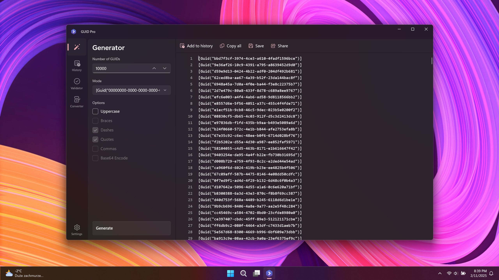

# GUID Pro

GUID Pro is a powerful and flexible tool that lets you generate, manage, validate, and convert GUIDs in multiple formats with ease, supporting up to 1 million identifiers at once.

  

  

Feel free to share ideas about new features or report bugs.
