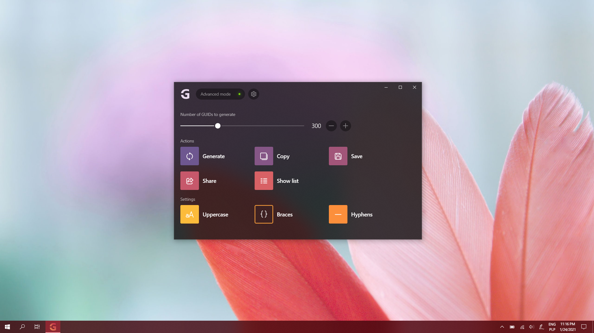

# GUID Pro

Welcome to the official issue-only repo for GUID Pro. GUID Pro is an universal app (pure UWP) that generates GUID identifiers in specified format.

  

Feel free to share ideas about new features or report bugs.
